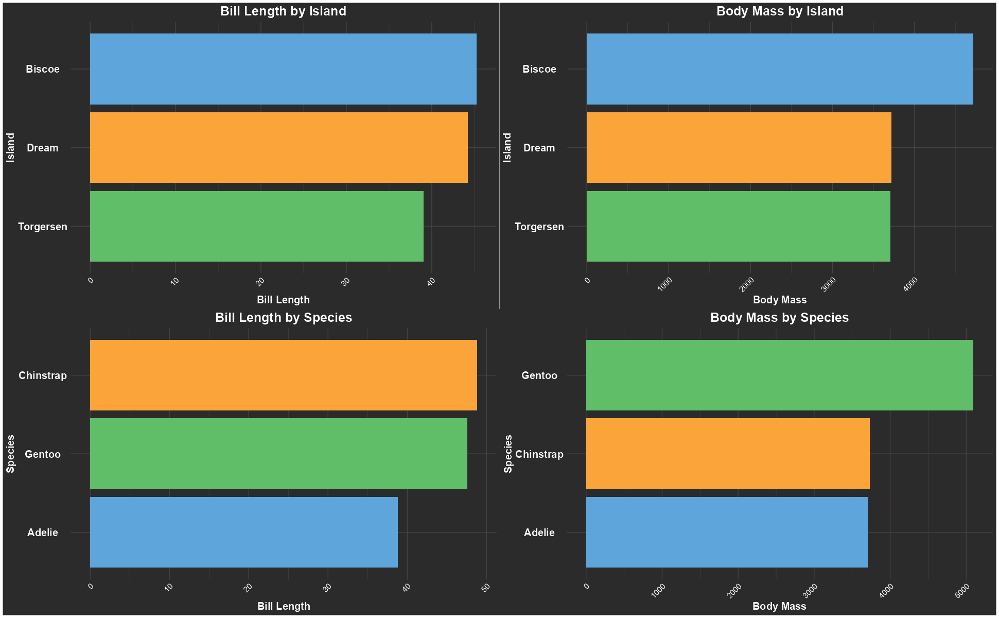

# Penguin Species Analysis 🐧

## Goal:
Explore how penguin size varies by species and island — focusing on bill length and body mass.

## Process:
1. Cleaned and grouped the data by species and island.
2. Calculated average bill length and body mass.
3. Built a dashboard combining four visual comparisons.

## Tools:
R, ggplot2, dplyr, patchwork  

**Dataset:** Palmer Penguins  
**Focus:** Data cleaning, grouping, and visualization

## Results:
The analysis shows clear differences in size patterns among penguin species and islands, likely driven by habitat and evolutionary adaptation.

