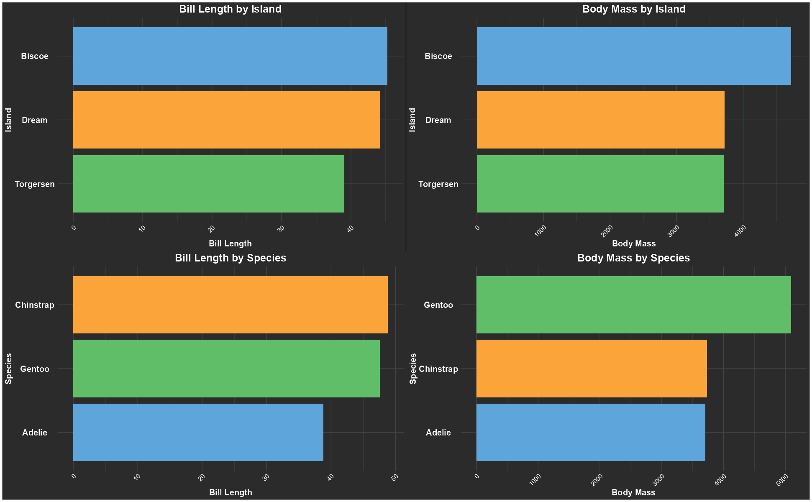

# Penguin Species Analysis 🐧

**Created:** 2025  
**Last updated:** 04/11/2025

## Goal:

Understand how **penguin size** and **physical traits** differ across **species** and **islands** to identify which **environments favor larger or smaller penguins**. This analysis could help **biologists or environmental researchers** study how habitat and adaptation influence penguin morphology.

## Process:

1.  Cleaned and grouped the data by species and island.
2.  Calculated average bill length and body mass.
3.  Built a dashboard combining four visual comparisons.

## Tools:

R, ggplot2, dplyr, patchwork

**Dataset:** Palmer Penguins\
**Focus:** Data cleaning, grouping, and visualization

## Results:

The analysis shows clear differences in size patterns among penguin species and islands, likely driven by habitat and evolutionary adaptation.

### Insights

-   Gentoo penguins tend to be the largest with longer bills, suggesting adaptation to deeper foraging habitats.
-   Some islands consistently have larger or smaller penguins within the same species, indicating differences in food resources or environmental conditions.
-   Body size and bill length are likely related to the type of prey available on each island, useful for ecological studies.
-   Morphological differences between species and islands suggest evolutionary adaptation to local conditions (climate, predators, food availability).
-   These patterns can serve as a reference for conserving critical habitats, especially on islands where limited resources may impact the survival of larger species.

---

## 🚀 Next Steps  

- Add **sex-based comparisons** to explore morphological differences between male and female penguins.  
- Incorporate **environmental data (temperature, food availability)** to link habitat with physical traits.  
- Create an **interactive dashboard (Shiny or Power BI)** for dynamic filtering by species and island.  
- Include **trend analysis over time** if longitudinal data becomes available.  
- Compare **Palmer Penguins** with other penguin datasets to identify global adaptation patterns.

---

## 🖼️ Preview  

---

**Author:** [Pablo – Data Analyst](https://github.com/PabloDataAnalyst) 
© 2025 Pablo. Shared publicly for portfolio purposes.